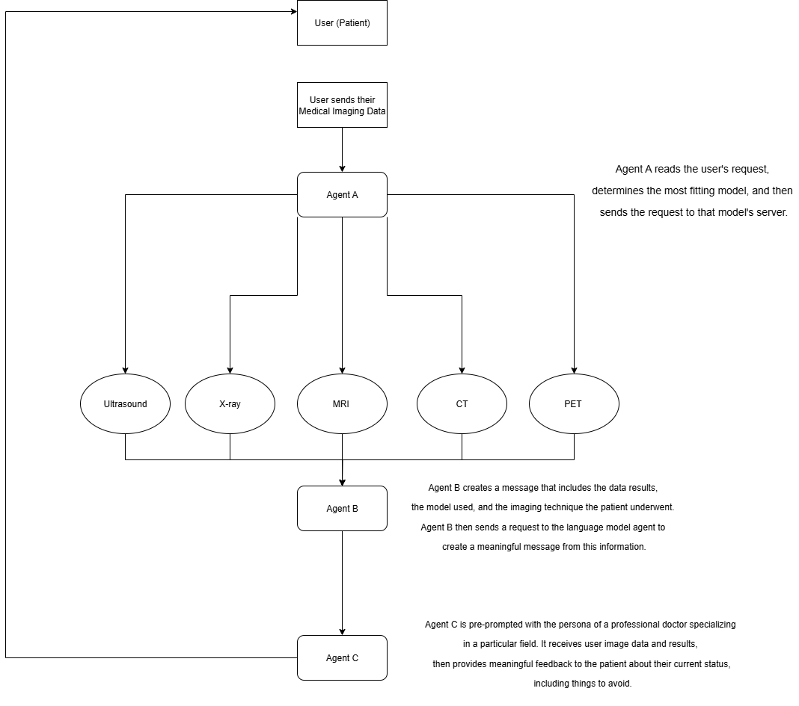

# MedAgents

This flowchart shows a system where a patient sends their medical images, and the data goes through several different agents.

* Agent A identifies the type of imaging and selects the most appropriate model to analyze it. 
* Agent B compiles the analysis results along with the imaging type and model used, then forwards this information to a language model agent. 
* Agent C, embodying the role of a medical professional, interprets the results and provides personalized feedback and advice to the patient. 

The system takes medical images and turns them into easy-to-understand, human-readable insights, helping patients and doctors make sense of the results quickly.

Some examples of the resulting output are shown in the images below:

     

